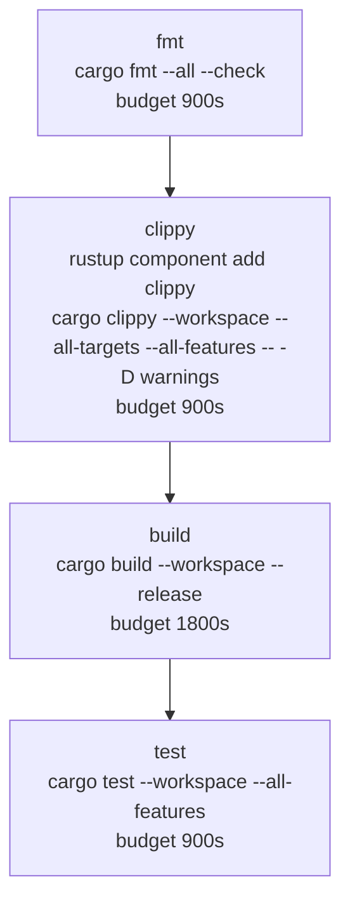

# tier-1 pipeline

CI reference for heraldstack-core contributors. covers how to trigger runs, what each step does, cache behavior, debugging failed steps, and how to add a new tier

## how to trigger a manual pipeline

**woodpecker UI**

- open `http://localhost:8210` (woodpecker-server web UI, port 8210 per global port index)
- navigate to the heraldstack-core repo
- select "trigger pipeline" and choose the `main` branch (or any branch with a `.woodpecker/` directory)

**woodpecker API**

```sh
curl -X POST \
  -H "Authorization: Bearer $WOODPECKER_TOKEN" \
  http://localhost:8210/api/repos/<repo-id>/pipelines \
  -H "Content-Type: application/json" \
  -d '{"branch": "main"}'
```

`WOODPECKER_TOKEN` is stored in `~/.secrets`. for the auth pattern and repo-id lookup, see `heraldstack-infra/scripts/verify-woodpecker-state.sh`

the `tier-1.yml` `when` block also fires on `push` and `pull_request` events — any push to a branch with `.woodpecker/tier-1.yml` starts a run automatically

## tier-1.yml anatomy

the pipeline file lives at `.woodpecker/tier-1.yml`. every step uses the same plugin image and the same settings shape

```yaml
when:
  - event: [push, pull_request, manual]
```

all three event types trigger the pipeline. there is no branch filter in pilot-1 — every push to any branch runs tier-1

**step structure (using `fmt` as the example)**

```yaml
- name: fmt
  image: heraldstack/woodpecker-fc-plugin:0.1.0
  environment:
    FC_POOL_BASE_URL: http://172.17.0.1:8150
  settings:
    image: heraldstack-ci-rust
    cancel_key: pilot1-tier1-fmt
    tier: 1
    time_budget_secs: 900
    cache_mounts_ro:
      - /srv/ci-cache/cargo
    env:
      CARGO_HOME: /ci-cache/cargo
    commands:
      - cargo fmt --all --check
```

- `image: heraldstack/woodpecker-fc-plugin:0.1.0` — the plugin docker image, built locally on rocm-aibox, pull policy `if-not-present`. no registry push required
- `environment.FC_POOL_BASE_URL` — docker bridge IP for fc-pool. `172.17.0.1` is the docker0 bridge host IP, reachable from the woodpecker-agent container to the systemd fc-pool process on the host
- `settings.image` — rootfs image name passed to fc-pool. maps to `<name>.ext4` in fc-pool's rootfs directory. `heraldstack-ci-rust` is the only allowlisted image for tier 1
- `settings.cancel_key` — static opaque string the plugin sends with the job dispatch. fc-pool uses it to authenticate cancel requests. replace with `${CI_PIPELINE_NUMBER}-${CI_STEP_NAME}` in sprint-2 when woodpecker secret injection is wired
- `settings.tier` — informational for policy enforcement in future tiers. currently unused
- `settings.time_budget_secs` — hard wall-time limit enforced by fc-pool's watchdog. `fmt`, `clippy`, `test` are 900s; `build` is 1800s
- `settings.cache_mounts_ro` — host paths fc-pool exposes read-only inside the guest. `/srv/ci-cache/cargo` is the cargo registry + index cache
- `settings.env.CARGO_HOME` — tells cargo to read from the mounted cache path. must match the mount target inside the guest
- `settings.commands` — ordered list of shell commands sent to ci-runner one at a time over vsock

**step dependency chain**

```yaml
clippy:
  depends_on: [fmt]
build:
  depends_on: [clippy]
test:
  depends_on: [build]
```

woodpecker executes steps in dependency order. a step failure stops the chain — `clippy` does not start if `fmt` fails

## step graph



each node is a separate woodpecker step. each step is a separate docker container (the plugin) that dispatches one CI job to fc-pool. each CI job is a fresh firecracker microVM. no VM state persists between steps

## cache hit behavior

`/srv/ci-cache/cargo` is a host directory mounted read-only into every guest. cargo reads the registry index and downloaded crate sources from this path via `CARGO_HOME=/ci-cache/cargo`

on a warm cache hit, cargo skips crate downloads and index updates. on a cold cache (first run after a rootfs rebuild or host cache wipe), cargo fetches from crates.io and the registry index — this adds ~30-90s depending on workspace size

the mount is **read-only** from the guest's perspective (`cache_mounts_ro`). cargo cannot write build artifacts back to the cache. compiled artifacts live in `CARGO_TARGET_DIR=/home/ci/.cargo-target` inside the guest's ephemeral rootfs — they do not persist across steps or runs. this means every step recompiles from source against the cached registry. a writable artifact cache is a follow-up task

the `heraldstack-ci-rust` rootfs pre-warms the crates.io index at image build time (the `cargo search --limit 1 serde` step in the toml recipe). this reduces cold-start fetch latency for the first run after a fresh rootfs

## debugging a failed step

**plugin SSE logs**

the plugin streams all guest stdout to woodpecker's step log via SSE. in the woodpecker UI, open the failed step — cargo error output appears inline. the plugin also logs its own connection state to stderr (docker container logs)

to read plugin container logs directly:

```sh
docker logs <woodpecker-agent-container-id>
```

the plugin is ephemeral — it exits when the step completes. woodpecker captures its stdout/stderr in the pipeline log

**fc-pool service logs**

fc-pool logs to journald. to follow:

```sh
journalctl -u fc-pool -f
```

relevant log lines on failure:

- `cold boot failed for CI image` — rootfs not found or VM start timeout
- `vsock-bridge not ready after 30s` — guest did not come up in time (kernel or init issue)
- `ci guest closed stream without exit sentinel` — ci-runner exited abnormally without printing `__CI_EXIT__:<code>`
- `ci job time budget exceeded` — the step ran past `time_budget_secs`

**guest serial output**

guest-init.sh writes diagnostic lines to `/dev/ttyS0`. firecracker captures serial output and fc-pool logs it via tracing when available. search journald for `mcp-init:` lines to trace guest boot sequence

**fc-pool debug endpoints**

no `/debug` endpoints exist in pilot-1. the status polling endpoint `GET /ci/jobs/{id}` returns current job state (Spawning, Running, Completed, Failed, TimeBudgetExceeded, Cancelled). adding a log-replay endpoint is tracked as a follow-up

## how to add a new tier

tiers map to rootfs image names in fc-pool's policy allowlist. the current allowlist contains `heraldstack-ci-rust`

to add a new tier:

- build a new rootfs image following the `buildfs/<name>.toml` pattern — alpine base, packages, run steps, entrypoint via vsock-bridge
- add the image name to fc-pool's `CI_ALLOWED_IMAGES` policy (in `crates/fc-pool/src/policy.rs` or equivalent)
- add a new `.woodpecker/<tier-name>.yml` in heraldstack-core following the same step structure as `tier-1.yml`, referencing the new image name in `settings.image`
- select a new static `cancel_key` prefix for the tier steps until woodpecker secret injection (sprint-2) replaces static keys

no changes to fc-pool's dispatch or runner code are required for a new rootfs — the vsock-bridge + ci-runner protocol is image-agnostic
